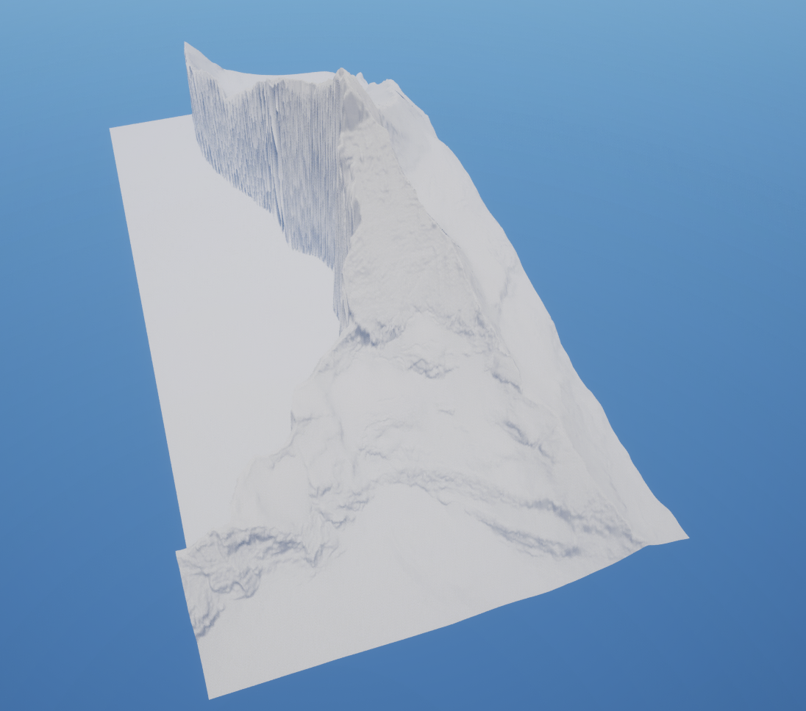
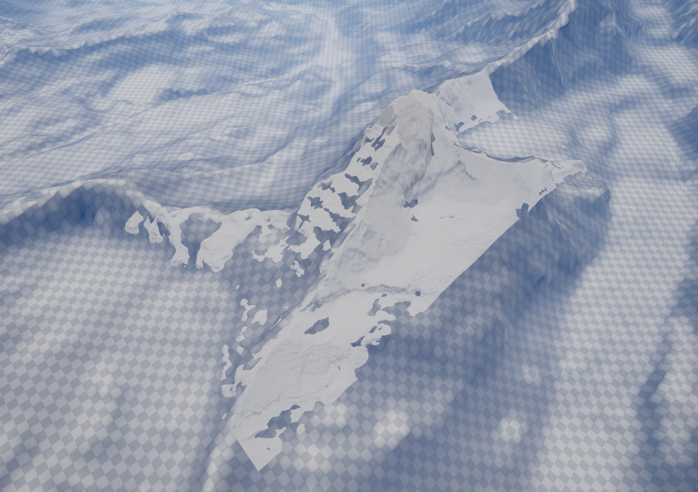
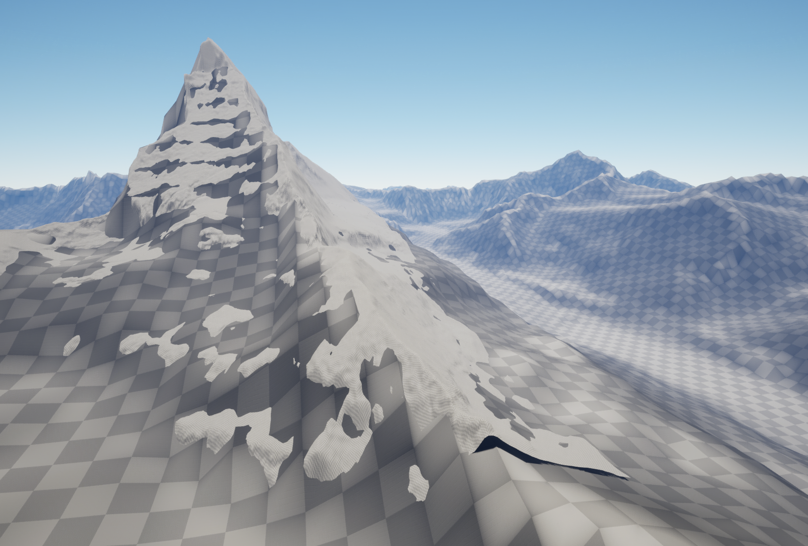
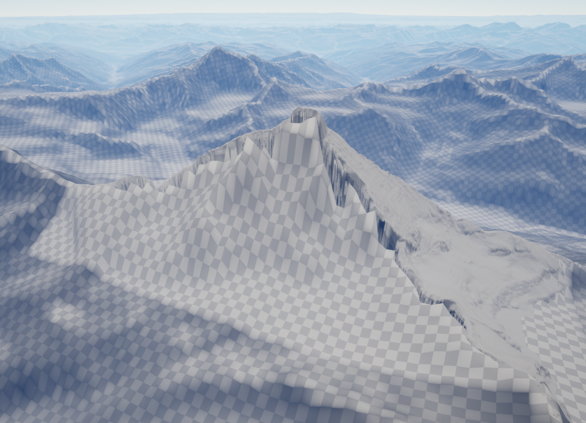

.. _blending:

Blending Landscapes
===================

If you created a landscape using Landscape Combinator, you will find that the newly created landscape
has a ``BlendLandscape`` component. You can also add this component manually on landscapes that you
created without Landscape Combinator.

In the ``BlendLandscape`` component, simply choose the landscape that you want to blend with,
and with on the ``Blend With Landscape`` button.

You can also explore the ``Advanced Blending Options``, which allow to specify custom curves
for blending the landscapes.

* | **DegradeThisData (pointer to UCurveFloat)**:
  | A curve that specifies how the data at the border of this landscape gets degraded into the other landscape.
  | The X axis of the curve represents the distance from the border of the overlapping region and goes from 0 (at the border) to (1 at the center).
  | The Y axis (Alpha) defines how we compute the new heightmap data:
  | ``NewData = Alpha * OldData + (1 - Alpha) * OverlappingLandscapeData``
  | For example, a curve which is always 1 means that this landscape data is not changed.
	
* | **DegradeOtherData (pointer to UCurveFloat)**:
  | A curve that specifies how the data at the border of a landscape overlapping with this one gets modified.
  | The X axis of the curve represents the distance from the border of the overlapping region and goes from 0 (at the border) to (1 at the center).
  | The Y axis (Alpha) defines how we compute the new heightmap data of the overlapping landscape.
  | For example, a curve which is always 1 means that the overlapping landscape data is not changed.
  | In addition, the data of the overlapping landscape will not be changed in the positions where this landscape's data is equal to `ThisLandscapeNoData`.
  | ``NewData = ThisData == ThisLandscapeNoData ? OldData : Alpha * OldData + (1 - Alpha) * OtherLandscapeNoData``
	
* | **ThisLandscapeNoData (double)**:
  | The Z value that this landscape takes when it has no data.
	
* | **OtherLandscapeNoData (double)**:
  | The Z value that the other landscape takes when it has no data.

Matterhorn Example
------------------

Matterhorn is a mountain at the border of Switzerland and Italy. The swissALTI3D data covering this area
only has data for the northern flank of the mountain. See the images below for the result of blending this
landscape with the L32 tile of Viewfinder Panoramas 3". This example is available in the ``Matterhorn`` level
of the plugin.

Before blending, on the left, there is the Matterhorn peak with missing data from swissALTI3D.
On the right, this is the L32 tile from Viewfinder Panoramas, with resolution scaled down to 30%.

.. image:: _static/images/before_blend3.png
  :alt: The Matternhorn low-resolution data in the L32 landscape

.. image:: _static/images/before_blend4.png
  :alt: The Matterhorn and L32 landscapes before blending

After blending:

.. image:: _static/images/after_blend1.png
  :alt: The Matterhorn and L32 landscapes before blending

The L32 landscape now has a hole that follows the curve below.
And the Matterhorn landscape data gets blended with the L32 data at the border.

.. image:: _static/images/after_blend3.png
  :alt: The L32 landscape after blending

.. image:: _static/images/after_blend4.png
  :alt: The Matterhorn peak with missing data from swissALTI3D

The curve for the Matterhorn landscape.

.. image:: _static/images/curve_other.png
  :alt: The curve for the Matterhorn landscape

The curve for the L32 landscape.

.. image:: _static/images/curve_this.png
  :alt: The curve for the L32 landscape
  
The Details Panel of the ``BlendLandscape`` component (on the Matterhorn landscape).

.. image:: _static/images/blend_details.png
  :class: details
  :alt: The Details Panel of the ``BlendLandscape`` component (on the Matterhorn landscape).
